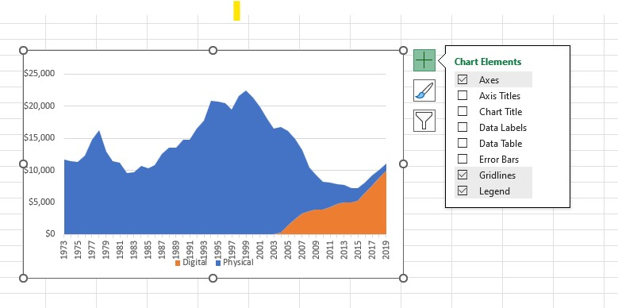
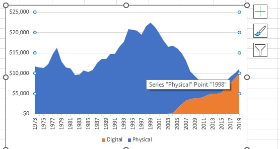
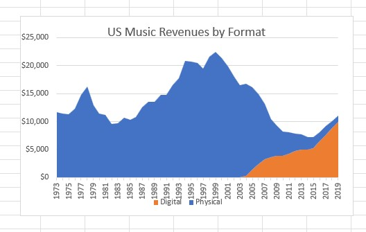
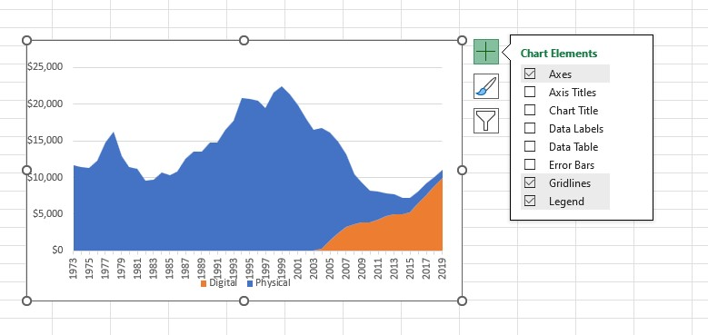
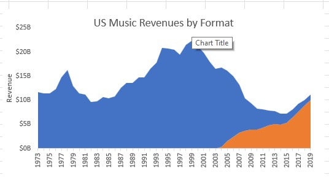
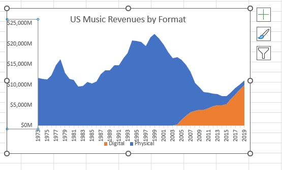
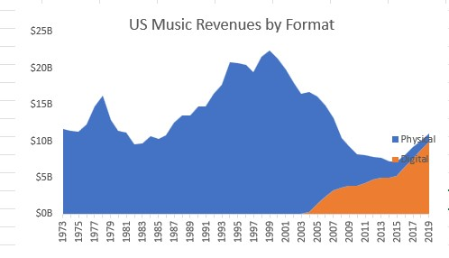
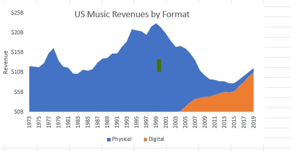
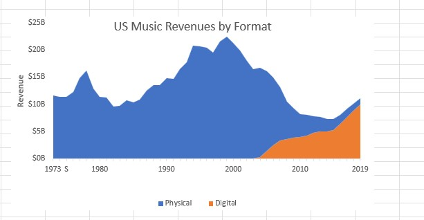

# 🎧 Music Industry Revenue Project: Composition Analysis

This repository contains the analysis and visualization of music industry revenue over a 40-year period, focusing on the shift in composition between **Physical** and **Digital** formats.

---

## 🎯 Project Goal

The primary objective was to visualize the **revenue composition over time** for Physical and Digital music products to communicate the industry's historical transition to a general audience. The visualization choice was a **Stacked Area Chart**, as it is ideal for showing composition over a time series.

---

## 📂 Source Data and Context

| Detail | Description |
| :--- | :--- |
| **Data Type** | Time Series |
| **Format** | Excel Spreadsheet |
| **Key Insight** | Revenue figures are in **Millions**, requiring specific axis formatting to convert to Billions for clarity. |
| **Communication Goal** | Composition over time (40 years) |
| **Target Audience** | General Public |
| **Visualization Choice** | **Stacked Area Chart** |

### Initial Assets

* **Chart Before Formatting:**
    * 

---

## 📈 Visualization Development Steps

The following steps detail the creation and formatting of the final **Stacked Area Chart** using data visualization best practices.

### 1. Chart Selection and Data Order

1.  **Selection:** Inserted a standard Stacked Area Chart.
2.  **Fixing Stacking Order:** The initial chart obscured the Digital baseline because it was stacked second. This was corrected by switching the series order so that **Digital** appeared *first* in the data list, allowing its baseline to be visible.
    * **Result after Fixing Stack Order:**
        * 

### 2. Formatting for Clarity (Reducing Noise)

| Action | Technique | Image |
| :--- | :--- | :--- |
| **Add Title** | Clearly labeled the chart to inform the user. |  |
| **Remove Gridlines** | Unchecked the **Gridlines** option using the Chart Elements menu. |  |
| **Add Y-Axis Title** | Added **Revenue** as the vertical axis title. |  |

### 3. Cleaning Up the Y-Axis (Revenue)

A custom number format was applied to correctly display revenue in billions and reduce redundant zeros.

1.  **Initial Adjustment (Millions):** Added `"M"` to the end of the format string.
    * **Result after adding 'M':**
        * 
2.  **Final Adjustment (Billions):** Used the custom format `\$#,##0, "B"` to scale the data to billions and drop redundant zeros.
    * **Result after converting to Billions:**
        * 

### 4. Final Polish and Legend Removal

1.  **Move/Adjust Legend:** The legend was moved to the bottom and expanded.
    * **Legend Moved and Adjusted:**
        * 
2.  **Set Text Size:** Standardized all axis labels to **Text Size 11** and deleted the years off the source data to clean up the X-axis labels.
    * **Result after deleting source years:**
        * 
3.  **Direct Labeling:** Text boxes for **PHYSICAL** and **DIGITAL** were added directly to the chart areas, and the redundant legend was deleted.

---

## ✨ Final Visualization

The completed chart provides a clean, highly formatted visualization of the music industry's composition shift.

*(Note: The `final_chart.png` placeholder assumes you have an image file of the final chart saved with this name. If you used one of the other uploaded files, please update the name.)*

---

Let me know if you'd like any of the captions adjusted or if you need this document formatted for a different file type!